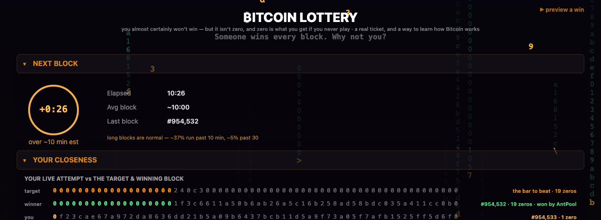
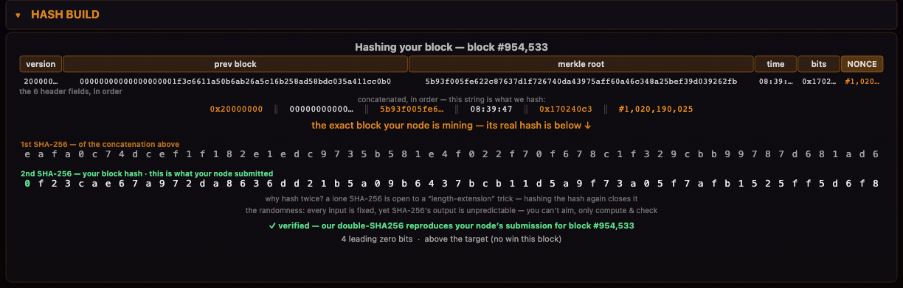
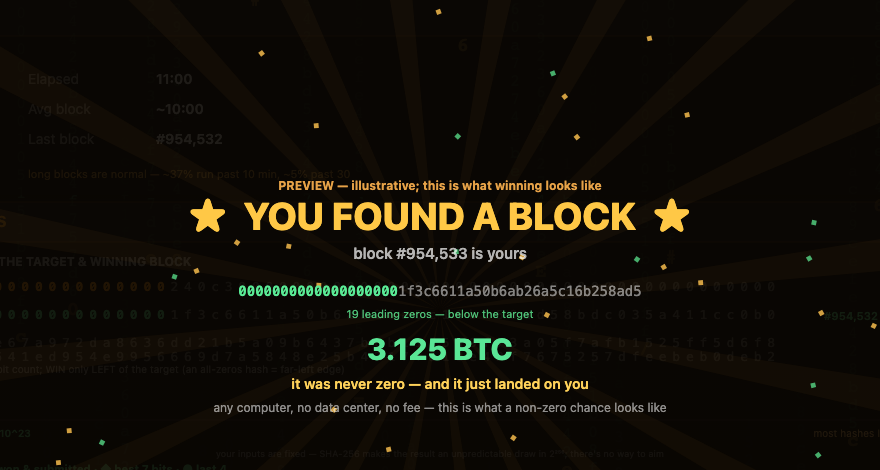

# ₿itcoin Lottery — *notzero*

> **You almost certainly won't win. But it isn't zero — and zero is what you get if you never play.**

A real Bitcoin **solo-mining lottery**. Your own node races the entire network for the block reward — every block, it builds the real block template, picks your one ticket, and submits a real block if it ever wins. The odds are astronomical (~1 in 10²³ per block), so realistically you never will. **That's the point:** a free, non-custodial lottery ticket, a way to actually *learn how Bitcoin works*, and a tiny, real, non-zero chance in a game that otherwise belongs to data centers.

**▶ Live demo: [demo.getnotzero.com](https://demo.getnotzero.com)**



---

## Three ways to take part

| | What you do | What you need |
|---|---|---|
| **Watch** | Open the dashboard in any browser — real Bitcoin network data, a simulated ticket, the whole visualization. | Nothing. |
| **Play (symbolic)** | Run the miner in symbolic mode — your deterministic ticket each block, no node. | Python. |
| **Mine for real** | Run your own Bitcoin node + the miner. It builds the real coinbase, hashes the real header, and submits a real block if you win. | A pruned `bitcoind` (one-time sync) + your wallet address. |

Most people watch. The committed few mine for real. Both are honest about what they are.

## The honest odds

Winning a block solo is roughly **1 in 10²³ per block.** To put that in perspective:

> **You are far more likely to win the Powerball jackpot several times in a row than to win a single block this way.**

You will, in all probability, never win. So why do it?

- **It isn't zero.** A ticket moves you from *impossible* to *possible*. Zero is what you get if you never play.
- **You learn how Bitcoin actually works** — headers, hashing, difficulty, the merkle tree — by watching your own node do it.
- **It's yours.** Your node, your block template, your hash. No pool, no custodian, no fee.
- **A regular computer in a game owned by warehouses.** If a solo miner ever wins, everyone running this finds out — the block announces itself on-chain.

## What you're looking at

The dashboard is a single HTML5 canvas, no dependencies. It reflects your real node when one is connected, and runs a faithful demo when one isn't.

- **NEXT BLOCK** — live countdown to the next block; counts up honestly when a block runs long.
- **YOUR CLOSENESS** — an odds map plotting your attempts by leading-zero bits against the target. Winning is a thin sliver on the far left; your attempts cluster on the right. It's a brutally honest picture of the gap.
- **HASH BUILD** — watch the real 80-byte block header get assembled field by field, concatenated, and double-SHA256'd into your block hash — then verified, byte-for-byte, against what your node actually submitted.

  

- **NETWORK** — BTC price, network hashrate vs difficulty, next halving.
- **The reward ladder** — *new best* (you beat your own record) → *a lottery miner wins* (detected on-chain via the coinbase tag) → **you win** (the full celebration). Each tier of "not zero" gets a moment.

  

## Is it safe to run?

When people hear "Bitcoin miner," two fears come up: a machine screaming at 100% with a huge power bill, or malware quietly hijacking your computer to mine for someone else. **This is neither — and you don't have to take my word for it, because the code is open.**

- **It barely touches your computer.** A solo lottery ticket is *one* hash per block — about one calculation every ten minutes, not the trillions-per-second of a mining rig. In practice the miner sits at **~0% CPU and a few MB of RAM** (the dashboard shows the live numbers). Your laptop fan won't even notice. It is the *opposite* of cryptojacking malware, which exists precisely to max out your CPU.
- **It can't touch your coins.** It's non-custodial: it never sees a private key or wallet. You give it a *receive* address — the only place a reward could ever go — and nothing else. (Set your own; by default it goes to the project, clearly flagged in the app.)
- **It doesn't phone home.** It talks only to *your own* Bitcoin node and the public mempool.space API. No accounts, no telemetry, no hidden servers.
- **You can read every line.** That's the entire reason it's open source — you, or anyone you trust, can verify exactly what it does before running it. *Don't trust, verify.*

The one real cost is bitcoind's **first blockchain sync** (bandwidth + time, one time) — pruning keeps the disk footprint small. After that it's a quiet background hum, not a furnace.

## How it's built

```
web/                 the dashboard — vanilla JS + HTML5 canvas, zero dependencies.
                     reads ./node.json (your local node, same-origin) + mempool.space.
lottery_miner.py     the solo miner daemon — getblocktemplate → build coinbase → hash → submitblock.
scripts/node_bridge.py  publishes your node's status to web/node.json for the dashboard (no external calls).
app/                 native macOS settings + node/daemon manager (Windows & Linux managers planned).
tests/               deterministic snapshot tests for the animated canvas (Playwright).
```

A few things I cared about while building it:

- **Correct Bitcoin internals**, hand-rolled and verified against the spec test vectors: 80-byte header serialization, double-SHA256, compact-`bits` → target, BIP-34 coinbase height, the merkle root, and bech32 / bech32m address validation (BIP-173 / BIP-350, including taproot).
- **Honest by construction.** "LIVE" only appears when the node is genuinely synced *and* mining; the dashboard re-derives the block hash from the header and checks it byte-for-byte against the node's real submission before claiming "verified." Third-party data is never presented as proof.
- **Failure modes matter when a win is once-in-a-lifetime.** A found block is written to disk *before* `submitblock`, so a transient RPC error can never lose it — and a background worker then auto-resubmits (hard early, backing off to 30s, capped) until the node accepts it or the height is taken by another block, resuming even after a crash/restart. No manual step in the ~10-minute window. The published `node.json` leaks no peer IPs or hostname; credential files are `0600`.
- **Deterministic tests for an animated canvas** — reduced-motion to freeze the loop, fully-mocked data, and exact panel-rect clipping so the rotating quote and version string never enter a baseline.
- **Accessibility** — honours `prefers-reduced-motion`, colorblind-safe shape cues, pauses rendering on a hidden tab.

## Run it yourself

**Just the dashboard (demo):**
```bash
cd web && python3 -m http.server 8787   # → open http://localhost:8787
```

**Mine for real:** install a pruned `bitcoind`, point the miner at its RPC, and set your payout address.
```bash
cp config.default.json ~/Library/Application\ Support/BitcoinLottery/config.json   # then edit it
python3 scripts/node_bridge.py        # publishes web/node.json for the dashboard
python3 lottery_miner.py --daemon     # the solo miner
```
> The first node sync downloads the full chain (hundreds of GB of bandwidth) while pruning keeps disk small — it takes a while. That's the "earn your node" part of the story.

**Tests:** `npm install && npm test` (Playwright snapshot suite).

## Honesty notes

- This is a **lottery, not an investment**, and not financial advice. The odds are real and astronomical.
- **Set your payout address.** If you run live mode without one, the block reward defaults to the project owner's address (clearly flagged in the app). Set yours so a win is *yours*.
- Open source on purpose: it touches a payout address and builds blocks, so you should be able to read exactly what it does. *Don't trust — verify.*

## License

Released under the [MIT License](LICENSE) — free to use, modify, and run.

---

[a **spiralocean** project](https://spiralocean.com)
